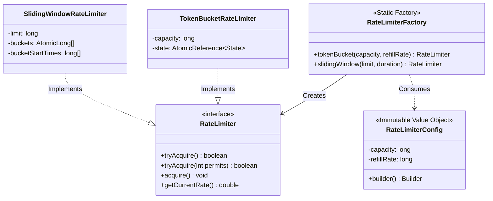
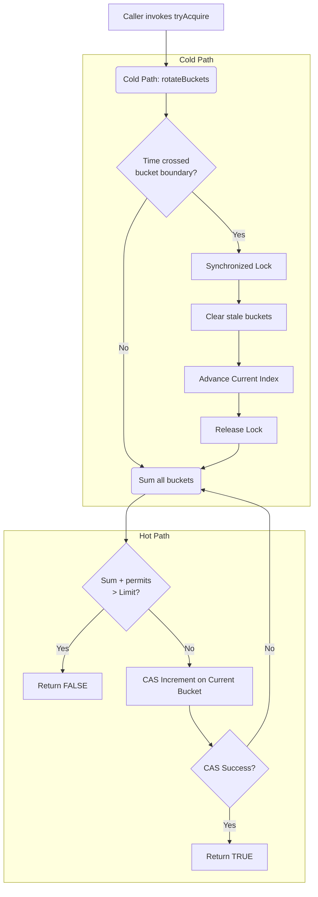

```mermaid
sequenceDiagram
    participant Caller
    participant AtomicReference (State)
    participant Memory
    
    Caller->>AtomicReference (State): 1. get() current State
    AtomicReference (State)-->>Caller: returns (tokens=5, time=T1)
    
    rect rgb(30, 30, 30)
        Note over Caller: 2. Lazy Refill Computation<br/>Calculate elapsed time since T1.<br/>Add accrued tokens to bucket.
    end
    
    rect rgb(30, 30, 30)
        Note over Caller: 3. Permit Check<br/>If (accrued_tokens < permits) return FALSE
    end
    
    rect rgb(30, 30, 30)
        Note over Caller: 4. Compute New State<br/>newTokens = accrued_tokens - permits
    end
    
    Caller->>AtomicReference (State): 5. compareAndSet(oldState, newState)
    
    alt CAS Succeeds
        AtomicReference (State)->>Memory: 6. Write newState
        AtomicReference (State)-->>Caller: returns TRUE (Permit Granted)
    else CAS Fails (Thread Collision)
        AtomicReference (State)-->>Caller: returns FALSE
        Note over Caller: 7. Loop back to Step 1 (Spin Retry)
    end
```

# System Design & Architecture: Java Rate Limiter

This document provides a deep dive into the system design, concurrency model, and architectural decisions behind the Java Rate Limiter library.

---

## 1. High-Level Architecture

The library is designed around the **Interface Segregation** and **Factory** design patterns to completely decouple consumers from the underlying synchronization primitives and algorithm implementations.

### Component Diagram



---

## 2. Concurrency Model Philosophy

The core engineering challenge in a rate limiter is **contention**. When thousands of threads request permits simultaneously, traditional `synchronized` locks cause thread suspension, context switching, and massive latency spikes. 

This library employs **Non-Blocking Synchronization (Lock-Free algorithms)** using hardware-level Compare-And-Swap (CAS) instructions (`AtomicReference`, `AtomicLong`).

**Key Tenets:**
1. **Zero Background Threads:** Refills and window slides are computed *lazily* on the caller's thread during the `tryAcquire()` execution. This reduces memory footprint and eliminates thread-scheduling jitter.
2. **Lock-Free Hot Paths:** 99.9% of operations execute without JVM monitors. Threads spin briefly on CAS failures rather than parking.
3. **Immutable State Transitions:** Complex state changes (like updating token count *and* timestamps simultaneously) are modeled as immutable state objects swapped atomically via `AtomicReference`.

---

## 3. Token Bucket Design

The Token Bucket algorithm handles "bursty" traffic perfectly. It allows a sudden burst of requests up to the `capacity`, then throttles to the `refillRate`.

### The "Phantom Empty" Race Condition & Solution
A naive lock-free implementation uses two fields: `AtomicLong tokens` and `AtomicLong lastRefillTime`. 
However, this is fundamentally flawed. Between updating the time and updating the tokens, another thread can read inconsistent state (seeing an empty bucket even after a refill). 

**Our Solution: The State Machine Pattern**
We pack both fields into an immutable `State` record and swap them in a single CPU instruction using `AtomicReference<State>`.

### Workflow: `tryAcquire(permits)`



---

## 4. Sliding Window Counter Design

The Sliding Window algorithm is strictly time-based and prevents the "double-spike" problem of fixed windows.

### Circular Array Architecture
Instead of keeping a `Queue` of timestamps (which requires O(N) memory and causes massive Garbage Collection pressure), we use a **Circular Array of `AtomicLong` buckets**.

If the window is 1 second, and we use 10 buckets, each bucket represents a 100ms time slice. 

### Hot vs. Cold Paths
Because we use an array, we cannot update the entire window state in a single CAS operation. Therefore, we split the logic:

1. **The Hot Path (Increment):** Lock-free CAS on a specific `AtomicLong` bucket.
2. **The Cold Path (Rotation):** Synchronized block that only executes when time has crossed a 100ms bucket boundary. It clears old buckets and advances the index.

### Workflow: `tryAcquire(permits)`



### Why is the Total Sum an Approximation?
In `SlidingWindowRateLimiter`, summing the buckets is done without a global lock. During the microsecond it takes to loop through the array, another thread might increment a bucket. 
- **Is this a bug?** No. This is a deliberate, documented engineering trade-off. 
- **Why?** A global lock would destroy throughput. By accepting an error margin of exactly `N - 1` requests (where N is the number of concurrent threads), we achieve ~16 Million ops/sec instead of ~1 Million ops/sec. For rate limiting (which is statistical throttling), this approximation is perfectly acceptable.

---

## 5. Extensibility & Future-Proofing

The library was intentionally architected behind interfaces to allow seamless future upgrades:

1. **Distributed Upgrades:** Because clients depend on `RateLimiter` (interface), a future `RedisRateLimiter` can be added, and clients only need to change the factory call:
   ```java
   // From this:
   RateLimiter rl = RateLimiterFactory.tokenBucket(100, 10);
   // To this:
   RateLimiter rl = RateLimiterFactory.redisTokenBucket(jedisPool, 100, 10);
   ```
2. **Observability:** The non-destructive `getCurrentRate()` method uses a lock-free trailing snapshot mechanism, making it entirely safe to expose to JMX beans or Prometheus/Grafana metric scrapers without degrading the performance of the actual rate limiting operations.
